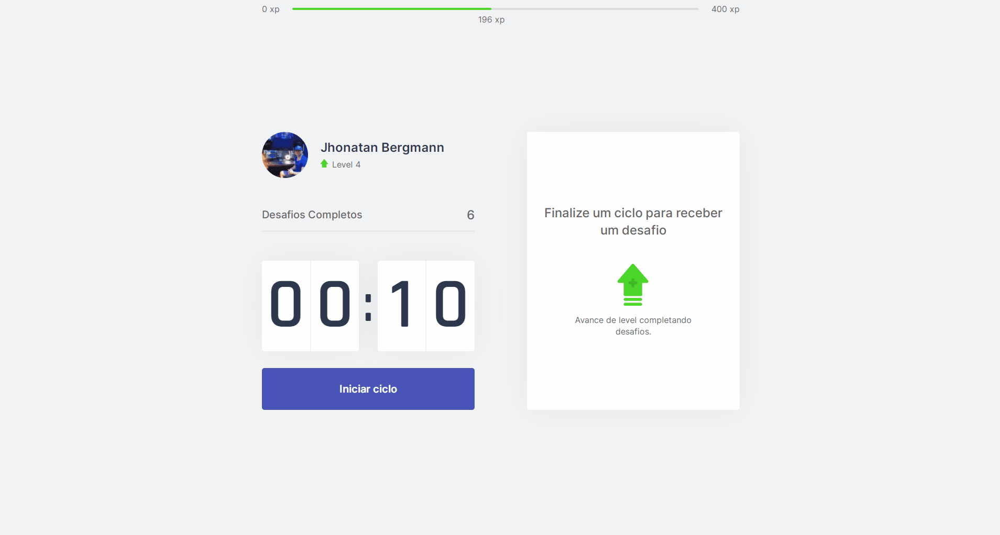

<h1 align="center">
  
   
  Moveit
   
</h1>

  
  
  
  

🤸🏻 Moveit 🤸🏻

## 🔺 Vercel 
### [Live Demo - Clique aqui!](https://moveit-kohl-gamma.vercel.app/)

## 📅 Sobre

Moveit utiliza a técnica de pomodoro com o objetivo de melhorar sua produtividade e foco.

  

## 🌐 Tecnologias Usadas
Foram usadas essas tecnologias:

- [React](https://pt-br.reactjs.org/)
- [NextJS](https://nextjs.org/)

## ***</>*** Como usar o código?
1. Instale o **Yarn** em seu computador
1. Instale o **NodeJs** na versão >= 12.0
1. Clone este repositório `git clone https://github.com/jhonbergmann/moveit.git`

### 🌐 Rodando
1. Acesse o diretório e dê o comando `yarn install`
1. Acesse a pasta e dê o comando `yarn dev`
1. Acesse em seu navegador a seguinte url `http://localhost:3000`

## 📝 Licença

Esse projeto está sob a licença MIT. Veja o arquivo [LICENSE](LICENSE) para mais detalhes.

---

 Feito com 💜 by Jhonatan Bergmann

